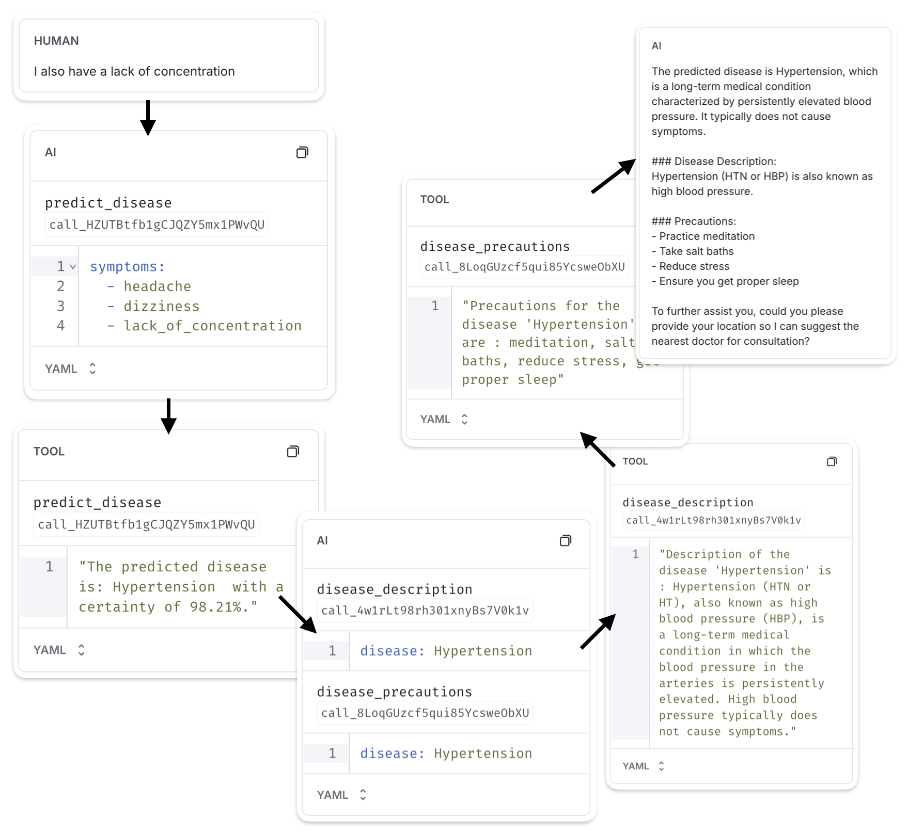

# AI-Driven Disease Prediction LangChain Assistant

This project is a disease prediction system built with **LangChain**, neural networks, and Google Maps API, designed to improve healthcare accessibility and efficiency. The system predicts diseases based on user-reported symptoms, provides descriptions and recommended precautions, and locates the nearest healthcare provider.


---

## 📖 **Features**

1. **Disease Prediction**

   - Predicts diseases based on user-reported symptoms using a trained neural network.
   - Provides a confidence score for each prediction.

2. **Detailed Medical Information**

   - Descriptions of the diagnosed disease.
   - Precautions to take based on the disease.

3. **Find the Nearest Doctor**

   - Leverages Google Maps API to locate and recommend the closest doctor.
   - Provides contact details for healthcare professionals.

---

## 🚀 **Getting Started**

### **Requirements**

- Python >= 3.9 and <3.12, I used version 3.11.15
- OpenAI API Key for disease prediction: [Get one here](https://platform.openai.com/signup/).
- Google Cloud API Key for locating doctors: [Sign up for free trial](https://cloud.google.com/).
- Optional: LangSmith API Key for tracking agent interactions: [Learn more](https://www.langchain.com/langsmith).

### **Setup**

1. **Clone the Repository**

   ```bash
   git clone https://github.com/tibo8f/tibo8f-langchain-disease-predictor.git
   cd tibo8f-langchain-disease-predictor
   ```

2. **Add API Keys**  
   Create a `.env` file in the root directory and add your API keys:

   ```env
   # This is the API key for OpenAI
   OPENAI_API_KEY="your_openai_api_key"

   # Google Cloud API key for accessing Maps API
   GOOGLE_MAP_API_KEY="your_google_map_api_key"

   # LangSmith tracing setup (optional)
   LANGCHAIN_TRACING_V2=true
   LANGCHAIN_ENDPOINT="https://api.smith.langchain.com"
   LANGCHAIN_API_KEY="your_langsmith_api_key"
   LANGCHAIN_PROJECT="your_project_name"
   ```

   **Note:** If you choose not to use LangSmith, remove the following lines from `app.py`:

   ```python
   os.environ["LANGCHAIN_TRACING_V2"] = "true"
   os.environ["LANGCHAIN_API_KEY"] = os.getenv("LANGCHAIN_API_KEY")
   ```

---

## 🔧 **Usage**

### **Launching the Application**

1. Open two terminals and go into the src folder if you are not already in it:

   ```bach
   cd src

   # OR
   cd tibo8f-langchain-disease-predictor/src
   ```

2. In the first terminal, start the backend FastAPI service:

   ```bash
   uvicorn app:app --reload
   ```

3. In the second terminal, start the user interface :

   ```bash
   streamlit run ui.py
   ```

4. Access the application in your browser: [http://localhost:8501](http://localhost:8501).

---

## 🌍 **Supporting Sustainable Development Goal (SDG) 3**

This project aligns with **SDG 3: Good Health and Well-being**, which aims to promote health and well-being for all ages. It addresses two critical targets:

1. **Target 3.4**  
   _"Reduce premature mortality from non-communicable diseases through prevention and treatment."_  
   The system helps detect diseases early, enabling users to take timely action.

2. **Target 3.d**  
   _"Strengthen early warning and risk management for global health."_  
   By providing disease predictions and locating nearby doctors, the system supports underserved regions with limited healthcare resources.

---

### 📌 **How the System Contributes**

- **Accessibility**: Available online and works in any language with internet access.
- **Early Diagnosis**: Helps identify potential illnesses and guides users to appropriate care.
- **Equity**: Provides critical health information to reduce disparities in underserved areas.
- **Efficiency**: Minimizes unnecessary doctor visits by helping users self-assess their symptoms.

---

This project is not a substitute for medical professionals but serves as a valuable tool for initial symptom assessment and healthcare guidance.

## 🧠 **The AI Tool**

The AI tool is the core component of this system, built to predict diseases based on user-reported symptoms. It leverages a trained neural network to provide a disease diagnosis along with a confidence score.

---

### 📊 **Dataset and Preprocessing**

The AI model is trained on a Kaggle dataset with **4,920 rows** and **17 columns**, representing up to 17 symptoms for 41 diseases. To prepare the data for accurate predictions, the following steps were taken:

- **Standardizing Data**: Unified inconsistent symptom names (e.g., `"dischromic patches"` → `"dischromic_patches"`).
- **One-Hot Encoding**: Transformed symptoms into a binary format (1 = present, 0 = absent).
- **Duplicate Removal**: Removed 4,616 duplicates while retaining incomplete rows to improve generalization.

After preprocessing, the dataset was reduced to **304 unique rows** and **132 symptoms**, each mapped to one of **41 diseases**.

---

### 🕸️ **Neural Network Architecture**

The neural network was designed to recognize patterns in the data and assign confidence levels to predictions. It consists of:

- **Input Layer**: A binary vector with 132 inputs (one per symptom).
- **Hidden Layers**:
  - **Layer 1**: 128 neurons (ReLU activation), chosen to match the dataset complexity.
  - **Layer 2**: 64 neurons (ReLU activation), focusing on key patterns.
- **Output Layer**: 41 neurons (softmax activation), one for each disease, providing a probability distribution.

This architecture ensures accurate disease predictions while maintaining computational efficiency.

---

### 🔍 **Performance and Confidence**

- **Training Results**: Initial simpler models (e.g., smaller hidden layers) failed to capture the dataset's complexity. Using two hidden layers (128 and 64 neurons) achieved **100% accuracy** during training and cross-validation. However, achieving 100% accuracy strongly suggests that the model is **overfitting**. In real-world scenarios, symptoms often overlap between multiple diseases, and the system should not be able to always predict the correct disease with absolute certainty. This level of accuracy likely indicates that the model has memorized the training data rather than learning generalizable patterns, reducing its effectiveness in handling unseen or ambiguous symptom sets.

- **Confidence Scores**: The model provides a certainty percentage for each prediction. If confidence is below **75%**, the system prompts users for additional symptoms to improve accuracy.

**Example of Certainty of Predictions:**

| **Disease Predicted** | **Symptoms Provided**                                   | **Certainty** |
| --------------------- | ------------------------------------------------------- | ------------- |
| Fungal infection      | Skin rash, itching, nodal eruptions, dischromic patches | 99.91%        |
| Fungal infection      | Skin rash, itching, nodal eruptions                     | 98.37%        |
| Fungal infection      | Skin rash, itching                                      | 60.18%        |
| Fungal infection      | Skin rash                                               | 30.22%        |
| Fungal infection      | Itching                                                 | 20.89%        |

---

### ⚙️ **Re-training the Neural Network**

If disease predictions are inaccurate, retrain the model:

1. Open `disease_prediction_model.ipynb` in the `src` folder.
2. "Run all cells, it will automatically:
   - Load and preprocess the dataset.
   - Train the model for 50 epochs.
   - Save the updated model and label encoder. Make sure these lines of code are not commented out:
   ```python
   joblib.dump(model, '../models/disease_prediction_model.pkl')
   joblib.dump(label_encoder, '../models/label_encoder.pkl')
   ```

---

## 🗂️ Search in Database Tools

To enhance the disease prediction process, I implemented two complementary tools to provide additional information after a disease has been identified:

1. **Disease Description Tool**:

   - Retrieves a concise description of the identified disease.
   - Uses the dataset [`symptom_Description.csv`](./datasets/symptom_Description.csv), which contains two columns:
     - `Disease`: The name of the disease.
     - `Description`: A brief explanation of the disease.

2. **Disease Precaution Tool**:
   - Suggests precautions to take for the identified disease.
   - Uses the dataset [`symptom_precaution.csv`](./datasets/symptom_precaution.csv), which includes:
     - `Disease`: The name of the disease.
     - `Precaution_1` to `Precaution_4`: Four recommended actions to mitigate the condition.

### Dataset Standardization

To ensure smooth communication between tools, disease names were standardized by converting them to lowercase, removing extra spaces, and replacing spaces with underscores (e.g., `"Heart Attack"` → `"heart_attack"`). This eliminated naming inconsistencies and improved query reliability.

---

## 📍 Google Maps API Tool

The Google Maps API Tool connect users with the nearest healthcare provider.

**How It Works:**

1. **User Location Input**: The system prompts the user to provide their location.
2. **Geocoding API**: Converts the user’s location into latitude and longitude coordinates.
3. **Places API**: Searches for nearby "doctor" locations and ranks results by proximity using the `rankby=distance` parameter.
4. **Doctor Information**: Retrieves the name, address, and phone number of the closest doctor and shares it with the user.

---

## 🧠 Memory Integration

The system uses **MemorySaver** to remember past interactions, ensuring all previously shared symptoms are considered during disease prediction. This allows the agent to request additional symptoms when needed.


---

## ✍️ Prompt Engineering

Effective prompt design ensured the agent utilized tools correctly and provided coherent responses. Key improvements included:

- **Tool Prioritization:** Adjusted the prompt to ensure tools are used in the correct sequence, prioritizing disease prediction before providing descriptions or precautions.
- **Language Consistency:** Standardized all outputs to English and added instructions for the agent to match the user's language.
- **Interpreting Tool Outputs:** Reformulated responses so the agent processes and integrates tool outputs into natural replies instead of copying them verbatim.
- **Symptom Validation:** Enforced validation and transformation of user-provided symptoms to match the expected format, e.g., "out of breath" → "breathlessness."
- **Tool Enforcement:** Explicitly prohibited disease predictions without calling the `predict_disease` tool.

---

## 💡 Proof of Concept

This section showcases a typical interaction with the LangChain-based system, highlighting its functionality through three main phases: symptom input, disease prediction, and follow-up with medical guidance and doctor location.


---

### **Step 1: Symptom Input and Initial Prediction**

The user begins by providing symptoms, such as:  
`"I have a headache and feel dizzy."`

The system processes the input, extracting and normalizing symptoms for compatibility with the `predict_disease` tool (e.g., transforming "dizzy" to "dizziness"). The tool attempts to predict a disease but may report insufficient certainty when the symptoms provided are too general.

In this scenario, the system:

- **Requests additional symptoms** to improve the prediction.
- **Asks for the user’s location** in preparation for locating a doctor if no disease can be confidently identified.
  

---

### **Step 2: Adding Symptoms for Accurate Prediction**

Next, the user provides more details, such as:  
`"I also have a lack of concentration."`

The system, using its memory capabilities, combines this new input with the previous symptoms to form a complete symptom set:  
`["headache", "dizziness", "lack_of_concentration"]`

With this updated input, the system:

- Successfully predicts **Hypertension** with a confidence level of 98.21%.
- Retrieves additional information using the `disease_description` and `disease_precautions` tools.
- Shares a detailed description of the disease along with specific precautions, such as practicing meditation and reducing stress.

## 

### **Step 3: Finding the Nearest Doctor**

Finally, the user provides their location, for instance:  
`"I’m in front of the Palais de Justice in Brussels."`

The system forwards the location to the `find_nearest_doctor` tool, which interacts with the Google Maps API to:

- Convert the address into geographic coordinates.
- Search for the nearest healthcare professional.
- Return the doctor’s name, address, and phone number.

The user receives actionable guidance, completing the interaction with both medical insights and direct access to professional care.


---

## 🌱 **Environmental Impact**

### **Training Emissions**

- **Duration**: 16 seconds (including preprocessing).
- **Energy Consumption**: ~7 Watts.
- **Carbon Footprint**: 3.11 mg CO2.

### **API Calls**

- **ChatGPT**: 12.96 g CO2 per interaction.
- **Google Maps API**: 19.17 mg CO2 per interaction.

## 👤 Author

This project was developed by **Thibaut** as part of a Master's course in Artificial Intelligence (MA2).

Thank you for taking the time to explore this project! 😊

**GitHub:** [tibo8f](https://github.com/tibo8f)
